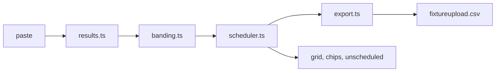

# Architecture — Regrade
Mode: hackathon. Last structural change: 2026-09-26 (docs/adr/0002).

## Overview
One static page for volunteer fixture secretaries: pasted results become team tallies, tallies become bands, bands become four weeks of pairings placed into pitch slots, and the block becomes the CSV the FA's Full-Time uploader takes. No server, no database, no model; everything runs in the browser and the download is the only output.

## Components
| Component | Responsibility | Tech | Why it exists (requirement) | When it fails |
|---|---|---|---|---|
| Results reader `src/results.ts` | parse two CSV layouts, name bad rows, tally teams, collect played pairings | TypeScript | MUST: results in (contract) | bad header → one error; bad rows → named, good rows load |
| Bander `src/banding.ts` | bands by goals per game, moves, spread, regraded count | TypeScript | MUST: banding | n/a (pure) |
| Scheduler `src/scheduler.ts` | per-week matching (no repeats, home/away balance), slot assignment, independent recount | TypeScript | MUST: four-week block with the constraints (AC-1, AC-2) | strict search fails → relax and log; no slot → unscheduled list |
| Exporter `src/export.ts` | fixtureupload.csv, nine columns, DD/MM/YYYY | TypeScript | MUST: export (AC-3) | n/a |
| Seed `src/seed.ts` | deterministic fictional league and results | TypeScript, mulberry32 | demo world, labelled synthetic | n/a |
| Workspace `src/main.ts`, `index.html`, `src/style.css` | state, rendering, drag and arrows, states, shortcuts | vanilla DOM, Vite | MUST: one coherent product experience (Design criterion) | render errors surface in the console; no network |
| Proof `scripts/validate.ts`, `tests/` | PASS/FAIL on the seeded league; unit tests on the branching functions | Node type stripping, Vitest | R18 deterministic proof; Potential Impact "based on what's demonstrated" | CI red |
| Hosting | static files | GitHub Pages via Actions | a stable URL for judges | Pages down → run locally (README quickstart) |

## Data flow

## Failure boundaries
- Parser: header or row errors are shown next to the textarea; the previous league stays loaded.
- Scheduler: three-step relaxation (strict balance → balance relaxed → played pairs allowed) with the relaxation logged; capacity shortfall produces the unscheduled list, never a partial grid presented as complete.
- Fonts: self-hosted and preloaded (they were a 0.85 layout shift when loaded from Google Fonts); system fallback if they fail.
- Hosting: single route; the app works offline once loaded.

## State and secrets
All state is in memory in `src/main.ts`; nothing persists; there are no secrets, keys or environment variables.

## Observability
The solver log panel on screen; the status region announces every outcome; CI runs typecheck, tests, validate and build on every push.
