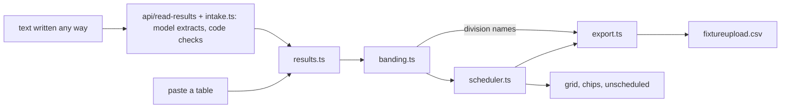

# Architecture — Regrade
Mode: hackathon. Last structural change: 2026-09-28 (docs/adr/0005).

## Overview
One page for volunteer fixture secretaries: pasted results become team tallies, tallies become bands, bands become four weeks of pairings placed into pitch slots, and the block becomes the CSV the FA's Full-Time uploader takes, plus a fixture list per club. Everything runs in the browser except one optional step: results written any way (a message, an email) can be sent to one server function, where a model extracts rows and code keeps only rows grounded in the text (docs/adr/0005). No database; the downloads are the only output. Hosted on Vercel.

## Components
| Component | Responsibility | Tech | Why it exists (requirement) | When it fails |
|---|---|---|---|---|
| Results reader `src/results.ts` | parse two layouts, comma- or tab-separated; name bad rows (missing or impossible scores, self-play, formula-leading names or divisions, duplicate dated rows); tally teams; played pairings; recorded divisions | TypeScript | MUST: results in (contract) | bad header → one error; bad rows → named and skipped, good rows load |
| Bander `src/banding.ts` | bands by goal difference per game with each division above counted 2 goals a game stronger (docs/adr/0004); division levels; moves; spread; export division names (fixed at proposal, so moves never rename a band) | TypeScript | MUST: banding | n/a (pure) |
| Scheduler `src/scheduler.ts` | per-week matching (no repeats, home/away balance), slot assignment, constraint counters; setup helpers `parseTimes`, `isSaturday`, `shortfallAdvice` | TypeScript | MUST: four-week block with the constraints (AC-1, AC-2) | strict search fails → relax (four tiers, 20,000-step budget each) and log; no slot → unscheduled list |
| Reader `src/intake.ts` + `api/read-results.ts` | free text → rows: one structured-output Gemini call; code checks every row against the line it cites, matches short names to known teams, and the parser validates; the secretary confirms | Vercel function, AI SDK, `@ai-sdk/google` | removes "results must be a table" (README limitation); Build With AI | off (no key, `AI_ENABLED=false`) → the button is hidden and the CSV path works; timeout, rate limit or model error → a plain message, the text stays |
| Exporter `src/export.ts` | fixtureupload.csv, nine columns, DD/MM/YYYY; any cell starting with = + - @ is prefixed with '; club fixture lists (text per club, CSV of all clubs) | TypeScript | MUST: export (AC-3) | n/a |
| Seed `src/seed.ts` | deterministic fictional league and results | TypeScript, mulberry32 | demo world, labelled synthetic | n/a |
| Workspace `src/main.ts`, `index.html`, `src/style.css` | state, rendering, drag and arrows, states, shortcuts | vanilla DOM, Vite | MUST: one coherent product experience (Design criterion) | render errors surface in the console; no network |
| Proof `scripts/validate.ts`, `tests/` | PASS/FAIL on the seeded league; unit tests on the branching functions | Node type stripping, Vitest | R18 deterministic proof; Potential Impact "based on what's demonstrated" | CI red |
| Hosting | static files and one function, security headers (CSP, nosniff, referrer and permissions policies), immutable caching for hashed assets | Vercel (the old GitHub Pages URL redirects) | a stable URL for judges; a place for the key | Vercel down → run locally (README quickstart); the reading step then needs `vercel dev` and a key |

## Data flow

## Failure boundaries
- Parser: a header error or zero good rows keeps the previous league loaded; otherwise the good rows replace it and the skipped rows are listed under a visible "Loaded N results" line.
- Scheduler: four tiers per week (strict → balance relaxed → season repeats allowed → block repeats allowed), each skipped at once if a team has no allowed partner and abandoned after 20,000 steps; relaxations and repeats are counted, shown in red and explained under the chips. Capacity shortfall produces the unscheduled list, never a partial grid presented as complete.
- Block and setup: each block keeps a copy of the slots it was generated in, so editing the setup afterwards can't misplace fixtures on screen; the block is marked stale and Download is blocked until Regenerate.
- Fonts: self-hosted and preloaded (they were a 0.85 layout shift when loaded from Google Fonts); system fallback if they fail.
- Hosting: single route; needs no network after the page loads (no service worker, so a reload needs a connection).

## State and secrets
All state is in memory in `src/main.ts`; nothing persists. One secret, `GOOGLE_GENERATIVE_AI_API_KEY`, lives only in Vercel's environment and is read by `api/read-results.ts`; `REGRADE_MODEL` and `AI_ENABLED` are optional. Nothing else is configured.

## External services
| Service | Used for | Limits and terms |
|---|---|---|
| Google Gemini API (learner's key) | reading free-text results | the key's own quota; on a free-tier key Google may use inputs to improve its products, so the UI says the text goes to Google Gemini |
| Vercel | hosting, the function | Hobby plan: non-commercial; function time capped at 30 s here |

## Observability
The solver log panel on screen; the status region announces every outcome; CI runs typecheck, tests, validate and build on every push.
