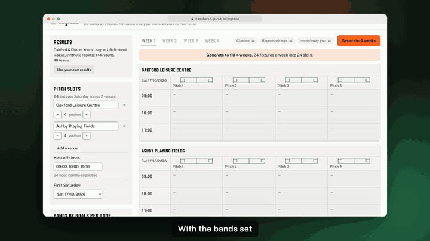
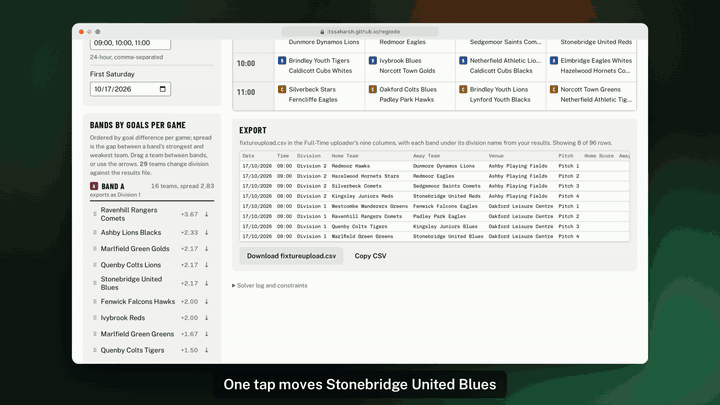
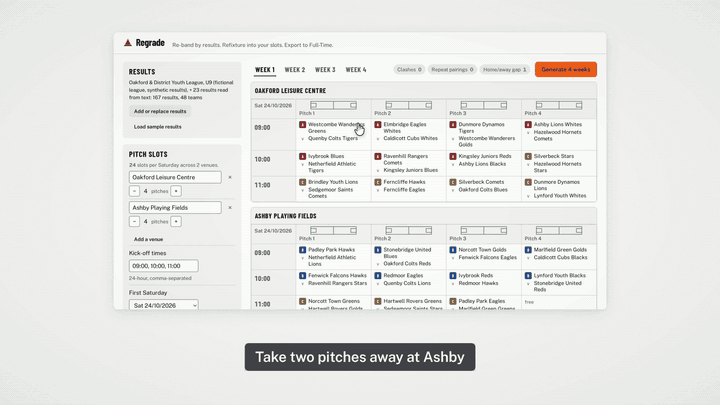
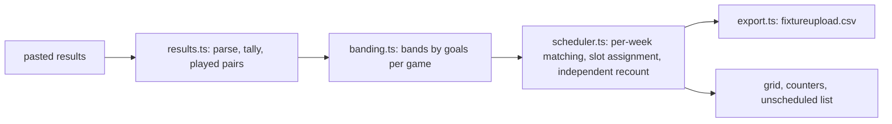

# Regrade

**Re-band youth-league teams by results and refixture them into your pitch slots, exported in the FA Full-Time uploader's layout.**

Built for Devpost's *Build With AI: Basics* hackathon with the Devpost Learn skill pack. Planning documents: [devpost/scope.md](devpost/scope.md), [devpost/prd.md](devpost/prd.md), [devpost/spec.md](devpost/spec.md), [devpost/checklist.md](devpost/checklist.md).

Live: https://itssaharsh.github.io/regrade/ · Video: (link in the Devpost submission)

| Generate four weeks | Move a team, rebuild | A short Saturday |
|---|---|---|
|  |  |  |

<sub>Clips from the demo video, recorded on the live site with the synthetic sample league.</sub>

## The problem
Volunteer fixture secretaries of mini-soccer leagues in England re-grade teams by results every few weeks and re-make the fixtures across shared central-venue pitches. The FA's Full-Time system schedules fixed divisions and checks clashes, but does not re-band by results, so the work happens in Excel: *"around 4-5 hours per age group each time"* ([a Kent league fixtures secretary, FA Grassroots Technology forum](https://grassrootstechnology.thefa.com/support/discussions/topics/48000566535)); at least two other leagues describe the same spreadsheet-then-upload workaround ([forum thread](https://grassrootstechnology.thefa.com/support/discussions/topics/48000559638)). The FA's own 52-page Full-Time Fixtures guide documents venue sharing, timeslots, a conflict checker and the uploader's nine-column CSV, and mentions banding nowhere ([guide, v5.1](https://www.thefa.com/-/media/cfa/sheffieldfa/files/technology/fixtures.ashx?la=en)). From the 2026-27 season the FA's FutureFit changes youth formats, so leagues are re-planning divisions and slots now ([England Football](https://www.englandfootball.com/articles/2025/Feb/21/Future-Fit-grassroots-youth-football-england-update-20252102)).

## What it does
1. Paste a block's results (the uploader layout with scores, or a simple table; comma- or tab-separated). Bad rows are named: missing or impossible scores, a team playing itself, names that would run as spreadsheet formulas.
2. Teams are ranked by goal difference per game and split into bands (as many as the file has divisions; adjustable). Results only come from games inside a division, so each division above counts as 2 goals a game stronger, the spread a Kent league aims for; on the sample this places 16 of 48 teams away from their true strength against 24 for the league's own guess (`npm run validate`). Every team that changes division shows the one it was in. Drag a team, or use the arrows.
3. Set the Saturday slots: venue names, pitches per venue, kick-off times and the first Saturday (checked to be a Saturday).
4. **Generate 4 weeks**: pairings that avoid any game already played this season, every team within one home game of its away games, one fixture per slot and pitch, each band grouped at as few venues as possible (splits are logged). When a band is too small or has already played nearly everyone, a rule is relaxed and the red counter says which band and why. Odd bands rest one team each Saturday, in turn, listed under the grid. Fixtures that don't fit are listed with the pitches or kick-offs to add.
5. Download **fixtureupload.csv** in the Full-Time uploader's nine-column layout, each band under the division name from your results file (or one you type when the file has none). The download is blocked while the block is out of date, and the panel says when fixtures that didn't fit are missing from the file.

## Evidence for each judging criterion
| Criterion (rules wording) | Where to look |
|---|---|
| Design: "a complete, coherent product experience" | one workspace: results in, bands, slots, grid, counters, unscheduled list, export; states `?state=first-run`, `generated`, `stale`, `partial`, `error` |
| Potential Impact: "a credible, specific case for solving a real problem for a real audience" | the forum quotes above; the export goes straight back into the system secretaries already use |
| Innovation/Idea: "does the project differ from existing concepts?" | re-banding from results plus regenerating only the next block, absent from Full-Time's guide and the generators surveyed (LeagueRepublic, LeagueLobster, fixturelist, open-source schedulers) |
| Presentation: "the video clearly demonstrate the project working end-to-end" | the video (link in the submission) runs the whole loop on the live site: bands, Generate, a secretary's move and Regenerate, the week plan with its byes, the export, and a pitch shortfall |

## What's real and what's synthetic
| Part | Status |
|---|---|
| Results parsing, banding, scheduler, CSV export | real, deterministic, tested |
| Sample league (Oakford & District Youth League, U9) | synthetic: 24 fictional clubs, 48 teams, six Saturdays of generated results, labelled on screen |
| Uploader column layout | from the FA's 2015 guide (v5.1); confirm against your league's uploader before use |
| Deployment | GitHub Pages; needs no network after the page loads (no service worker, so a reload needs a connection) |

## Quickstart
Node 22.6 or later (the validate script uses Node's TypeScript type stripping).
```
npm install
npm run dev        # open http://localhost:5173
npm run validate   # seeds a league, bands it, generates a block, recounts every constraint from the exported CSV
npm test           # 37 unit and rule tests
npm run typecheck && npm run build
```

## Architecture

Decisions: [docs/adr](docs/adr). Design: [UI-SPEC.md](UI-SPEC.md).

## Limitations
- The uploader layout is from a 2015 guide; a league admin should confirm it is current.
- Results must be pasted; no league-level export from Full-Time was found.
- One age group and three bands per workspace; mini-soccer central venues in England.
- Each exported division, venue and pitch name must already exist in Full-Time exactly as written; the export uses the names in your results file and your slot setup, and pitches are named Pitch 1, Pitch 2 and so on.
- The 2-goals-a-game gap between divisions is a fixed assumption taken from one league's target spread; a league whose divisions are closer or further apart would want a different figure.
- Pairings are chosen one week at a time. Late in a season, when few unplayed pairings are left, this can use a few more repeats than the best possible four-week plan (the counters show them).
- Tested on a synthetic league, not yet on a real league's season.
- Nothing is saved between visits: the downloaded file is the record.

## AI use
Planned and built with a coding agent through the Devpost Learn skill pack; see CLAUDE.md. No model runs in the app.
