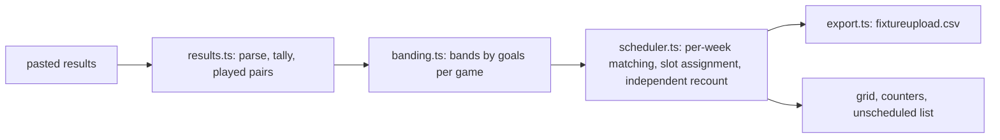

# Regrade

**Re-band youth-league teams by results and refixture them into your pitch slots. Export the file FA Full-Time imports.**

Built for Devpost's *Build With AI: Basics* hackathon with the Devpost Learn skill pack. Planning documents: [devpost/scope.md](devpost/scope.md), [devpost/prd.md](devpost/prd.md), [devpost/spec.md](devpost/spec.md), [devpost/checklist.md](devpost/checklist.md).

Live: https://itssaharsh.github.io/regrade/ · Video: (link in the Devpost submission)

## The problem
Volunteer fixture secretaries of mini-soccer leagues in England re-grade teams by results every few weeks and re-make the fixtures across shared central-venue pitches. The FA's Full-Time system schedules fixed divisions and checks clashes, but does not re-band by results, so the work happens in Excel: *"around 4-5 hours per age group each time"* ([a Kent league fixtures secretary, FA Grassroots Technology forum](https://grassrootstechnology.thefa.com/support/discussions/topics/48000566535)); four or more other leagues describe the same Excel-then-upload workaround ([forum thread](https://grassrootstechnology.thefa.com/support/discussions/topics/48000559638)). The FA's own 52-page Full-Time Fixtures guide documents venue sharing, timeslots, a conflict checker and the uploader's nine-column CSV, and mentions banding nowhere ([guide, v5.1](https://www.thefa.com/-/media/cfa/sheffieldfa/files/technology/fixtures.ashx?la=en)). From the 2026-27 season the FA's FutureFit changes youth formats, so leagues are re-planning divisions and slots now ([England Football](https://www.englandfootball.com/articles/2025/Feb/21/Future-Fit-grassroots-youth-football-england-update-20252102)).

## What it does
1. Paste a block's results (the uploader layout with scores, or a simple table). Bad rows are named.
2. Teams are ordered by goal difference per game and split into bands; each band shows its spread. Drag a team, or use the arrows.
3. Set the Saturday slots: venues, pitches, kick-off times, first Saturday.
4. **Generate 4 weeks**: pairings that never repeat a game already played this season, every team within one home game of its away games, one fixture per slot, a band at one venue per Saturday. Counters on screen; fixtures that don't fit are listed, never dropped.
5. Download **fixtureupload.csv** in the Full-Time uploader's nine columns.

## Evidence for each judging criterion
| Criterion (rules wording) | Where to look |
|---|---|
| Design: "a complete, coherent product experience" | one workspace: results in, bands, slots, grid, counters, unscheduled list, export; states `?state=first-run`, `generated`, `stale`, `partial`, `error` |
| Potential Impact: "a credible, specific case for solving a real problem for a real audience" | the forum quotes above; the export goes straight back into the system secretaries already use |
| Innovation/Idea: "does the project differ from existing concepts?" | re-banding from results plus regenerating only the next block, absent from Full-Time's guide and the generators surveyed (LeagueRepublic, LeagueLobster, fixturelist, open-source schedulers) |
| Presentation: "the video clearly demonstrate the project working end-to-end" | the video shows paste, drag, generate, download and the CSV opened beside the FA's column list |

## What's real and what's synthetic
| Part | Status |
|---|---|
| Results parsing, banding, scheduler, CSV export | real, deterministic, tested |
| Sample league (Oakford & District Youth League, U9) | synthetic: 24 fictional clubs, 48 teams, six Saturdays of generated results, labelled on screen |
| Uploader column layout | from the FA's 2015 guide (v5.1); confirm against your league's uploader before use |
| Deployment | GitHub Pages; the app works offline once loaded |

## Quickstart
```
npm install
npm run dev        # open http://localhost:5173
npm run validate   # seeds a league, generates a block, prints PASS/FAIL for every constraint
```

## Architecture

Decisions: [docs/adr](docs/adr). Design: [UI-SPEC.md](UI-SPEC.md).

## Limitations
- The uploader layout is from a 2015 guide; a league admin should confirm it is current.
- Results must be pasted; no league-level export from Full-Time was found.
- One age group and three bands per workspace; mini-soccer central venues in England.
- Nothing is saved between visits: the downloaded file is the record.

## AI use
Planned and built with a coding agent through the Devpost Learn skill pack; see CLAUDE.md. No model runs in the app.
